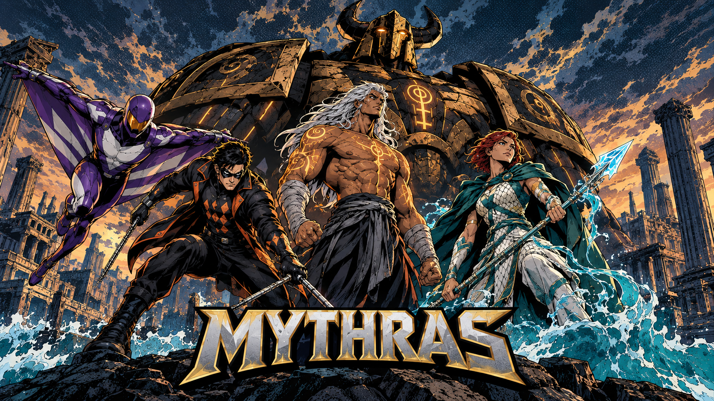

# Mythras Camp Half-Blood

[](https://github.com/SoftMissT/mythras-camp-half-blood/actions/workflows/validate.yml)
[](https://foundryvtt.com/)
[](https://foundryvtt.com/packages/mythras)
[](https://github.com/SoftMissT/mythras-camp-half-blood/releases/tag/v0.0.6)
[](LICENSE)



Módulo para Foundry VTT e sistema Mythras. A ficha Camp Half-Blood, rolagem rápida e visual claro em português ficam disponíveis por jogador.

## Download

**[Baixar a versão mais recente](https://github.com/SoftMissT/mythras-camp-half-blood/releases/latest/download/mythras-camp-halfblood.zip)**

Para instalar pelo manifesto, use o botão **Copy** no canto do bloco e cole o endereço no Foundry:

```text
https://github.com/SoftMissT/mythras-camp-half-blood/releases/latest/download/module.json
```

## Instalação

1. Foundry → **Add-on Modules** → **Install Module**.
2. Cole o endereço do manifesto acima ou instale o ZIP baixado.
3. Ative o módulo em um mundo que use o sistema `mythras`.
4. A ficha Camp Half-Blood inicia ativa no modo claro.

## Recursos

- Visual Camp claro ativado por padrão.
- Preferências individuais por jogador.
- Rolagem rápida de perícias sem substituir a mecânica nativa do Mythras.
- Resultado visual: falha vermelha, sucesso verde e crítico dourado.
- Não altera atributos, PV, perícias ou documentos dos personagens.
- Traduz o painel, os rótulos e os nomes canônicos de perícias que a ficha Mythras expõe; a ficha base continua pertencendo ao sistema Mythras.

## Compatibilidade

- Foundry VTT: v13+; verificado em v14.
- Sistema: `mythras`.
- Versão publicada: `0.0.6`.
- Atualizações: o manifesto `latest` permite que o Foundry encontre novas releases sem reinstalação manual.

## Licença

MIT [LICENSE](LICENSE).
